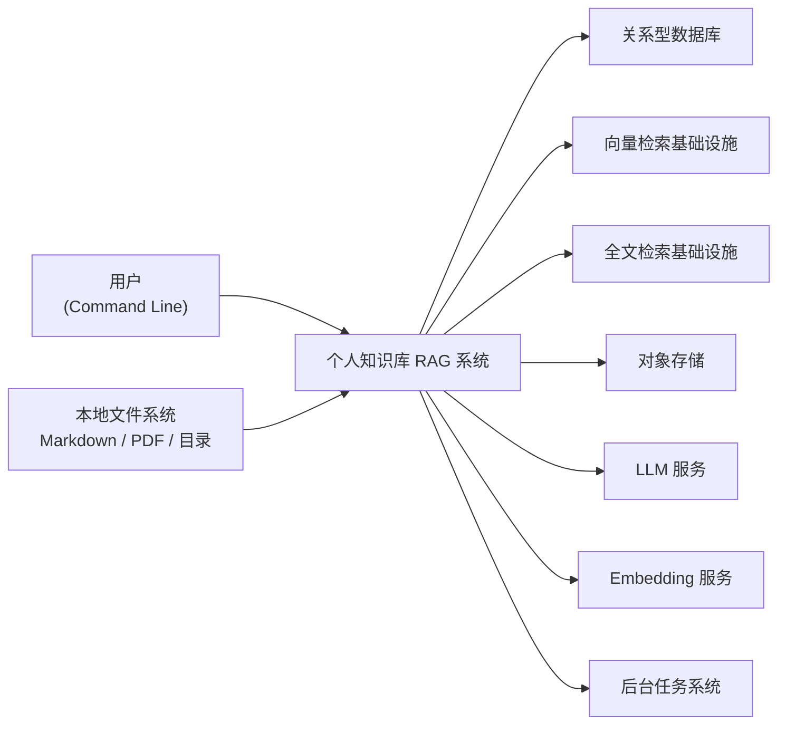

# 2.1 系统上下文图设计

## 任务目标

定义个人知识库 RAG 项目第一阶段的系统边界、主要参与者、外部依赖和核心交互关系，为后续系统架构图、模块拆分和接口设计提供统一上下文。

本子任务对应路线图中的 `2.1`：

- 绘制系统上下文图，明确前端、后端、存储、模型和任务系统的关系

## 关联文档

- `../step-01-product-scope/01.01-core-user-scenarios.md`
- `../step-01-product-scope/01.02-scenario-input-output-and-success-criteria.md`
- `../step-01-product-scope/01.03-first-phase-data-source-scope.md`
- `../step-01-product-scope/01.04-first-phase-generation-capability-scope.md`
- `../step-01-product-scope/01.05-non-goals-and-boundaries.md`

## 用户确认结论

基于当前讨论，`2.1` 采用以下正式前提：

- 系统第一阶段应 `可本地运行，但保留未来服务化扩展`
- 用户第一阶段的主要使用入口为 `命令行`
- 系统上下文图中应明确画出各类 `基础设施依赖`
- 模型能力在上下文层面区分为：
  - `LLM`
  - `Embedding`
- 文档同时兼顾：
  - 产品视角
  - 技术视角

## 系统上下文定义

在第一阶段，系统的核心定位是：

- 一个面向个人使用的知识库 RAG 工具
- 主要通过命令行触发导入、检索、问答、摘要和专题归纳能力
- 在本地环境运行
- 依赖本地或外部模型与存储基础设施

## 系统边界

### 系统内

以下内容属于“个人知识库 RAG 系统”边界内：

- 命令行入口
- 应用核心服务
- 导入与解析流程
- 检索与问答编排
- 摘要与专题归纳逻辑
- 与基础设施的访问协调层

### 系统外

以下内容属于系统边界外，但会与系统发生交互：

- 用户
- 本地文件系统
- 关系型数据库
- 向量检索基础设施
- 全文检索基础设施
- 对象存储
- LLM 服务
- Embedding 服务
- 后台任务系统

## 第一阶段主要参与者

### 1. 用户

通过命令行与系统交互，完成以下动作：

- 导入资料
- 发起检索
- 发起问答
- 生成摘要
- 生成专题大纲

### 2. 本地文件系统

作为第一阶段的主要资料来源，提供：

- Markdown 文件
- PDF 文件
- 本地目录批量导入路径

### 3. 关系型数据库

用于保存：

- 文档元数据
- chunk 元数据
- 标签
- 导入任务状态
- 检索和引用相关结构

### 4. 向量检索基础设施

用于支持语义检索与相关内容召回。

### 5. 全文检索基础设施

用于支持关键词检索、精确匹配和标题命中能力。

### 6. 对象存储

用于保存：

- 原始 Markdown / PDF 文件
- 后续可能扩展的附件对象

### 7. LLM 服务

用于支持：

- 基于知识库回答问题
- 单文档和多文档摘要
- 专题归纳

### 8. Embedding 服务

用于支持：

- 文档与 chunk 向量化
- 检索召回所需的向量能力

### 9. 后台任务系统

用于支持异步任务处理，例如：

- 文件导入
- 文档解析
- 切分与索引
- embedding 生成

## 系统上下文图

## 产品视角说明

从产品视角看，第一阶段的核心交互链路如下：

1. 用户通过命令行发起动作
2. 系统从本地文件系统读取资料或接收查询
3. 系统调用内部逻辑和外部基础设施完成处理
4. 系统返回检索结果、回答结果、摘要结果或专题结果

这一视角下，系统更像一个“面向个人使用的本地知识助手”。

## 技术视角说明

从技术视角看，第一阶段系统并不是一个完全独立闭环应用，而是一个协调层：

- 它协调本地资料输入
- 它协调数据库与索引基础设施
- 它协调 LLM 与 Embedding 模型能力
- 它协调同步请求和异步任务

因此第一阶段架构不应被设计成单个耦合脚本，而应保留未来服务化扩展能力。

## 第一阶段架构前提

根据当前上下文定义，后续架构设计应遵守以下前提：

### 1. 命令行是第一阶段主入口

后续接口和应用编排应优先服务命令行使用体验。

### 2. 本地运行是第一阶段主形态

应优先考虑本地开发、单机运行和个人使用成本。

### 3. 服务边界应保持清晰

虽然第一阶段可本地运行，但内部模块边界不应写死为单脚本模式，应为未来服务化扩展预留空间。

### 4. 基础设施依赖需要显式抽象

数据库、向量检索、全文检索、对象存储、LLM、Embedding 都应作为可替换依赖来看待。

### 5. 模型能力至少区分 LLM 与 Embedding

在架构设计和接口设计中，不应把所有模型能力混成一个统一黑盒。

## 第一阶段不在 `2.1` 解决的问题

以下问题不在本子任务中展开：

- 模块内部如何进一步拆分
- 各服务之间的详细时序
- 任务队列如何具体实现
- 数据库与向量库的具体产品选型
- Prompt 结构与回答协议细节

这些内容会在 `2.2`、`2.3`、`4.x`、`5.x`、`9.x`、`10.x` 中继续展开。

## 对后续任务的影响

`2.1` 的结论将直接影响：

- `2.2` 主业务链路图设计
- `2.3` 服务边界与模块职责定义
- `4.x` 基础设施映射关系设计
- `5.x` 命令行入口与导入任务接口设计
- `9.x` 检索编排层接口设计

## 最终结论

第一阶段系统上下文采用“本地运行、命令行优先、基础设施显式依赖、未来可服务化扩展”的设计思路：

- 主入口是命令行
- 主场景是个人本地知识管理
- 主能力是导入、检索、问答、摘要、专题归纳
- 主依赖是数据库、检索基础设施、对象存储和模型服务
- 主架构原则是边界清晰而不过度复杂

