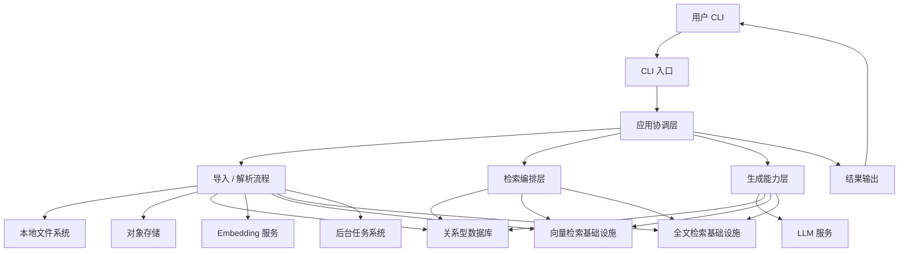
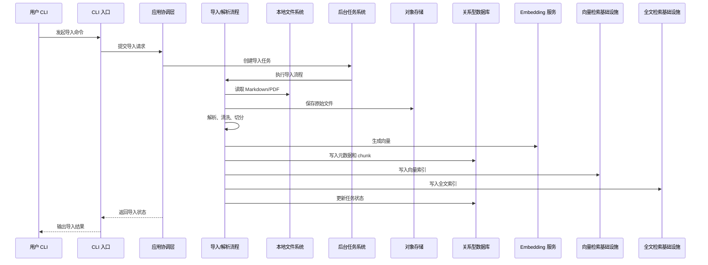
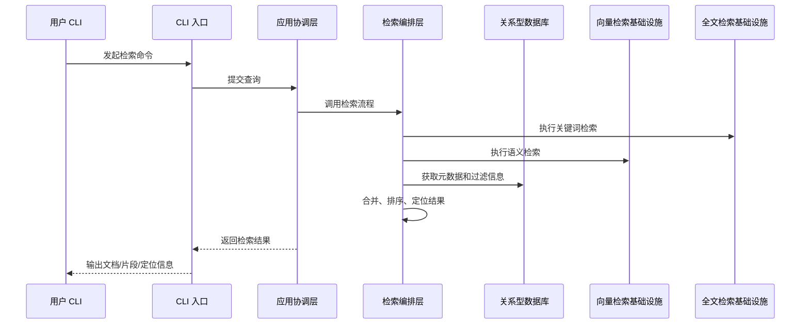
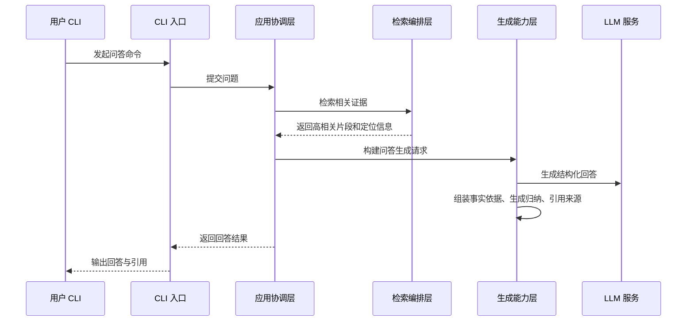
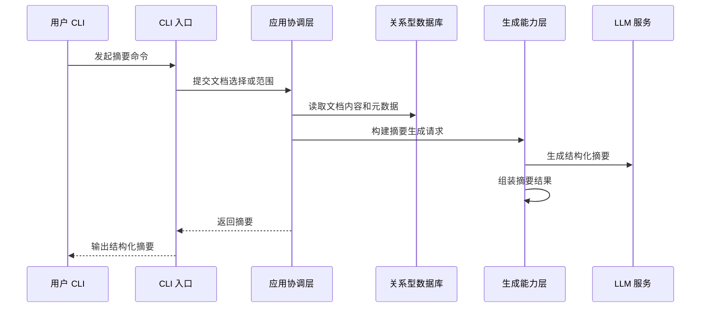
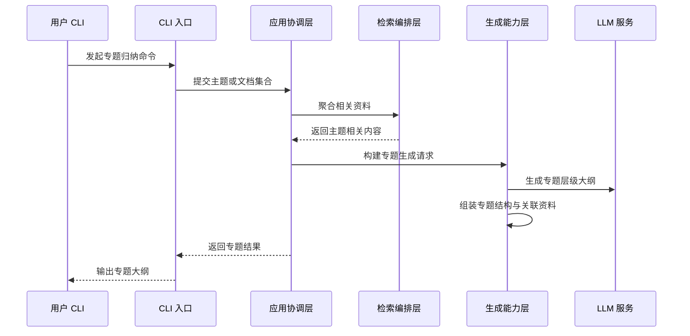

# 2.2 主业务链路图设计

## 任务目标

定义个人知识库 RAG 项目第一阶段的主业务链路，明确从用户触发到系统处理再到结果返回的核心流程，为后续导入设计、检索编排、生成能力设计和模块职责拆分提供统一基础。

本子任务对应路线图中的 `2.2`：

- 绘制主业务链路图，覆盖导入、解析、索引、检索、生成、展示

## 关联文档

- `02.01-system-context.md`
- `../step-01-product-scope/01.01-core-user-scenarios.md`
- `../step-01-product-scope/01.02-scenario-input-output-and-success-criteria.md`
- `../step-01-product-scope/01.03-first-phase-data-source-scope.md`
- `../step-01-product-scope/01.04-first-phase-generation-capability-scope.md`
- `../step-01-product-scope/01.05-non-goals-and-boundaries.md`

## 用户确认结论

基于当前讨论，`2.2` 采用以下正式范围：

- 覆盖 5 条主业务链路：
  - 导入链路
  - 检索链路
  - 问答链路
  - 摘要链路
  - 专题归纳链路
- 文档采用“两层表达”：
  - 一张总览图
  - 每条链路各一张简化时序图
- 在本任务中显式出现的核心内部模块包括：
  - CLI 入口
  - 应用协调层
  - 导入/解析流程
  - 检索编排层
  - 生成能力层
  - 基础设施依赖
- 问答、摘要、专题归纳链路按不同生成模式明确区分

## 主业务链路总览

第一阶段的主业务链路围绕 5 个 MVP 场景展开：

1. 导入资料并建立索引
2. 检索历史知识内容
3. 基于知识库进行问答
4. 对资料生成结构化摘要
5. 对资料进行专题归纳

## 主业务链路总览图

## 业务链路划分原则

### 1. 导入链路是所有能力的起点

没有稳定导入、清洗、切分和索引，就没有可靠的检索和生成结果。

### 2. 检索链路是所有知识使用能力的基础

问答、摘要、专题归纳虽然表现不同，但本质上都依赖资料读取、检索召回或内容聚合能力。

### 3. 生成链路必须区分模式

问答、摘要、专题归纳虽然都调用生成能力，但其输入、上下文构建方式和输出结构不同，不能混成单一路径。

### 4. 本任务关注主链路，不展开实现细节

本任务只定义“业务流程怎么流”，不展开“模块内部怎么实现”。

## 链路 1. 导入链路

### 业务目标

将 Markdown 或 PDF 资料导入系统，并完成解析、切分和索引，为后续检索和生成提供基础。

### 简化时序图

### 关键说明

- 导入链路主要通过异步任务完成
- 导入结果必须能进入后续检索和问答链路
- 第一阶段重点支持 Markdown 和文本型 PDF

## 链路 2. 检索链路

### 业务目标

根据关键词或自然语言查询，找到与问题最相关的文档或知识片段，并支持定位到具体位置。

### 简化时序图

### 关键说明

- 第一阶段检索成功标准强调“定位到具体位置”
- 检索链路本身不负责开放式生成
- 检索结果需要可直接供问答链路复用

## 链路 3. 问答链路

### 业务目标

基于知识库中的证据内容，返回结构化回答，并附带清晰引用。

### 简化时序图

### 关键说明

- 问答链路必须建立在检索链路之上
- 回答中必须区分“事实依据”和“生成归纳”
- 当证据不足时，应保守回答或拒绝回答

## 链路 4. 摘要链路

### 业务目标

对单篇或多篇资料提取重点内容，并返回结构化摘要。

### 简化时序图

### 关键说明

- 摘要链路不一定需要显式检索查询
- 第一阶段摘要输出优先采用结构化摘要
- 多文档摘要强调归纳，不是简单拼接

## 链路 5. 专题归纳链路

### 业务目标

围绕一个主题聚合相关资料，并输出层级结构大纲和核心观点。

### 简化时序图

### 关键说明

- 专题归纳链路依赖资料聚合能力
- 第一阶段专题结果以“层级结构大纲”为主
- 专题归纳不应输出脱离资料的新结论

## 五条主链路之间的关系

五条链路不是孤立存在，而是存在明显依赖关系：

- 导入链路为其他链路提供数据基础
- 检索链路为问答和专题归纳提供证据基础
- 摘要链路可直接基于已选文档内容执行
- 专题归纳链路依赖聚合与生成能力协同

## 第一阶段链路设计原则

### 1. 导入优先异步

导入、解析、切分和索引是重操作，优先通过后台任务处理。

### 2. 检索优先定位

检索链路强调可定位性和证据可追溯性，而不是只返回模糊相关结果。

### 3. 生成优先证据驱动

问答、摘要、专题归纳都必须建立在文档内容和检索证据之上。

### 4. 输出优先结构化

第一阶段的主要输出都应尽量采用结构化形式，便于 CLI 展示和后续扩展。

## 第一阶段不在 `2.2` 展开的内容

以下内容不在本任务中细化：

- 各模块的内部实现方式
- 检索排序算法细节
- Prompt 模板与具体字段协议
- 后台任务框架选型
- 数据表和索引字段设计

这些内容将在后续 `2.3`、`4.x`、`5.x`、`8.x`、`9.x`、`10.x` 中继续展开。

## 对后续任务的影响

`2.2` 的结论将直接影响：

- `2.3` 服务边界与模块职责
- `5.x` 导入任务流设计
- `8.x` 检索接口设计
- `9.x` 检索编排与上下文构建设计
- `10.x` 问答、摘要、专题生成协议设计

## 最终结论

第一阶段主业务链路采用“总览 + 分链路时序”的方式描述：

- 总览图用于统一理解系统主流程
- 导入、检索、问答、摘要、专题归纳分别作为 5 条主链路
- 每条链路保持结构清晰，但不过早陷入实现细节
- 所有链路共同服务于“个人知识库的可追溯检索与证据驱动生成”

