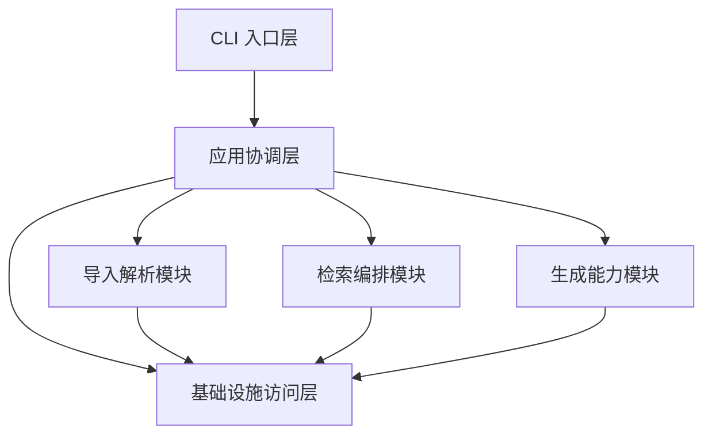

# 2.3 服务边界与模块职责定义

## 任务目标

定义个人知识库 RAG 项目第一阶段的核心模块边界与职责分工，明确每个模块负责什么、不负责什么、输入输出是什么、依赖哪些基础设施，为后续代码结构设计、接口拆分和实现协作提供统一边界。

本子任务对应路线图中的 `2.3`：

- 为每个服务定义输入输出接口和职责边界

## 关联文档

- `02.01-system-context.md`
- `02.02-main-business-flows.md`
- `../step-01-product-scope/01.01-core-user-scenarios.md`
- `../step-01-product-scope/01.02-scenario-input-output-and-success-criteria.md`
- `../step-01-product-scope/01.03-first-phase-data-source-scope.md`
- `../step-01-product-scope/01.04-first-phase-generation-capability-scope.md`
- `../step-01-product-scope/01.05-non-goals-and-boundaries.md`

## 用户确认结论

基于当前讨论，`2.3` 采用以下正式原则：

- 第一阶段系统内部按 6 个核心模块划分：
  - CLI 入口层
  - 应用协调层
  - 导入解析模块
  - 检索编排模块
  - 生成能力模块
  - 基础设施访问层
- 数据库、向量检索、对象存储、模型服务在本任务中定义为：
  - `基础设施依赖`
- 每个模块采用统一结构描述：
  - 负责什么
  - 不负责什么
  - 主要输入
  - 主要输出
  - 依赖谁
- 后台任务系统不单独作为业务模块，而是：
  - 应用协调层与导入解析模块依赖的执行机制

## 模块划分总览

第一阶段系统内部建议划分为以下 6 个核心模块：

1. CLI 入口层
2. 应用协调层
3. 导入解析模块
4. 检索编排模块
5. 生成能力模块
6. 基础设施访问层

## 模块关系总览图

## 模块 1. CLI 入口层

### 负责什么

- 接收用户命令
- 解析命令参数
- 将用户请求转换为标准化应用请求
- 将系统返回结果以命令行形式输出给用户

### 不负责什么

- 不负责业务编排
- 不负责文档解析
- 不负责检索逻辑
- 不负责生成逻辑
- 不直接访问底层数据库或模型服务

### 主要输入

- 用户命令
- 命令参数
- 文件路径、查询语句、主题词、文档选择等输入

### 主要输出

- 标准化应用请求
- 命令行格式结果输出
- 错误提示与任务状态反馈

### 依赖谁

- 应用协调层

## 模块 2. 应用协调层

### 负责什么

- 统一承接来自 CLI 的业务请求
- 根据请求类型路由到不同业务模块
- 编排导入、检索、问答、摘要、专题归纳等主链路
- 组织最终输出结构
- 协调同步流程与异步任务执行

### 不负责什么

- 不负责文档底层解析细节
- 不负责检索排序算法细节
- 不负责生成内容本身
- 不直接实现数据库与模型服务访问逻辑

### 主要输入

- CLI 层传来的标准化请求
- 任务执行状态
- 各业务模块返回的中间结果

### 主要输出

- 对业务模块的调度请求
- 统一的业务结果对象
- 供 CLI 展示的结果结构

### 依赖谁

- 导入解析模块
- 检索编排模块
- 生成能力模块
- 基础设施访问层
- 后台任务执行机制

## 模块 3. 导入解析模块

### 负责什么

- 读取 Markdown 和 PDF 输入
- 执行文档解析、清洗、分段和切分
- 提取基础元数据
- 触发 embedding 生成与索引构建
- 形成可供检索和生成使用的知识单元

### 不负责什么

- 不负责命令行交互
- 不负责用户查询理解
- 不负责问答、摘要和专题归纳输出
- 不负责检索结果排序和回答组织

### 主要输入

- 文件路径
- 导入任务请求
- 原始 Markdown / PDF 内容
- 可选标签与来源备注

### 主要输出

- 文档元数据
- section 与 chunk 结构
- embedding 构建请求
- 索引写入请求
- 导入结果与错误信息

### 依赖谁

- 基础设施访问层
- 后台任务执行机制

## 模块 4. 检索编排模块

### 负责什么

- 接收查询请求
- 执行关键词检索与语义检索编排
- 合并多路召回结果
- 进行结果过滤、排序与定位
- 为问答和专题归纳提供证据上下文

### 不负责什么

- 不负责原始文档导入
- 不负责摘要或回答文本生成
- 不负责最终结果展示
- 不负责底层索引系统的直接选型细节

### 主要输入

- 查询语句
- 过滤条件
- 文档范围或主题范围
- 上下文构建请求

### 主要输出

- 检索结果列表
- 证据片段集合
- 可定位的引用信息
- 供生成模块使用的上下文材料

### 依赖谁

- 基础设施访问层

## 模块 5. 生成能力模块

### 负责什么

- 基于证据上下文生成结构化回答
- 生成单文档和多文档结构化摘要
- 生成专题层级大纲
- 将输出组织为约定结构
- 区分“事实依据”和“生成归纳”

### 不负责什么

- 不负责原始文档解析
- 不负责底层检索召回
- 不负责开放式方案生成
- 不负责超出证据范围的专业决策输出

### 主要输入

- 问答请求
- 摘要请求
- 专题归纳请求
- 来自检索编排模块或数据库读取的上下文内容

### 主要输出

- 结构化回答
- 结构化摘要
- 专题层级结构
- 引用来源与不确定性说明

### 依赖谁

- 基础设施访问层

## 模块 6. 基础设施访问层

### 负责什么

- 统一封装系统对外部基础设施的访问方式
- 屏蔽数据库、对象存储、向量检索、全文检索、LLM、Embedding 等依赖的具体接入细节
- 为上层模块提供稳定访问接口

### 不负责什么

- 不负责业务编排
- 不负责命令行交互
- 不负责业务语义判断
- 不负责决定最终输出结构

### 主要输入

- 上层模块提出的读写请求
- 检索请求
- 模型调用请求

### 主要输出

- 元数据读写结果
- 索引访问结果
- 模型调用结果
- 对象存储访问结果

### 依赖谁

- 关系型数据库
- 向量检索基础设施
- 全文检索基础设施
- 对象存储
- LLM 服务
- Embedding 服务

## 后台任务机制的定位

后台任务系统在第一阶段不作为独立业务模块，而作为执行机制存在。

### 主要服务对象

- 应用协调层
- 导入解析模块

### 主要用途

- 导入任务异步执行
- 文档解析和切分
- embedding 构建
- 索引写入

### 不承担的职责

- 不承担业务决策
- 不直接定义业务语义
- 不作为对外暴露的核心产品能力

## 模块边界设计原则

### 1. CLI 与业务逻辑隔离

命令行只负责用户交互，不应承载核心业务逻辑。

### 2. 协调层与实现层分离

应用协调层负责流程编排，不应沉淀底层细节实现。

### 3. 检索与生成分离

检索编排模块和生成能力模块必须清晰分离，避免检索逻辑和生成逻辑混杂。

### 4. 基础设施依赖显式抽象

所有外部依赖都通过基础设施访问层统一管理，便于未来替换和演进。

### 5. 模块设计服务于后续代码结构

当前模块划分不追求“服务越多越先进”，而追求后续代码目录、接口边界和测试边界清晰。

## 第一阶段不在 `2.3` 展开的内容

以下内容不在本任务中细化：

- 代码包结构如何映射到目录
- 每个模块内部再细分哪些子组件
- 基础设施访问层的具体接口签名
- 后台任务系统的具体框架
- 数据模型和表结构细节

这些内容将在后续 `4.x`、`5.x`、`8.x`、`9.x`、`10.x` 和工程设计中继续展开。

## 对后续任务的影响

`2.3` 的结论将直接影响：

- `4.x` 数据与基础设施接口设计
- `5.x` 导入任务与接入接口设计
- `8.x` 检索接口与召回逻辑设计
- `9.x` 检索编排和上下文构建设计
- `10.x` 生成协议与 Prompt 结构设计
- 后续代码目录和模块划分设计

## 最终结论

第一阶段系统内部采用“6 个核心模块 + 基础设施依赖显式抽象”的方式组织：

- CLI 入口层负责交互
- 应用协调层负责业务编排
- 导入解析模块负责知识入库
- 检索编排模块负责证据召回
- 生成能力模块负责结构化输出
- 基础设施访问层负责统一访问底层依赖

这种划分兼顾了：

- 本地运行的简单性
- 未来服务化扩展的空间
- 后续代码结构和接口拆分的清晰度

