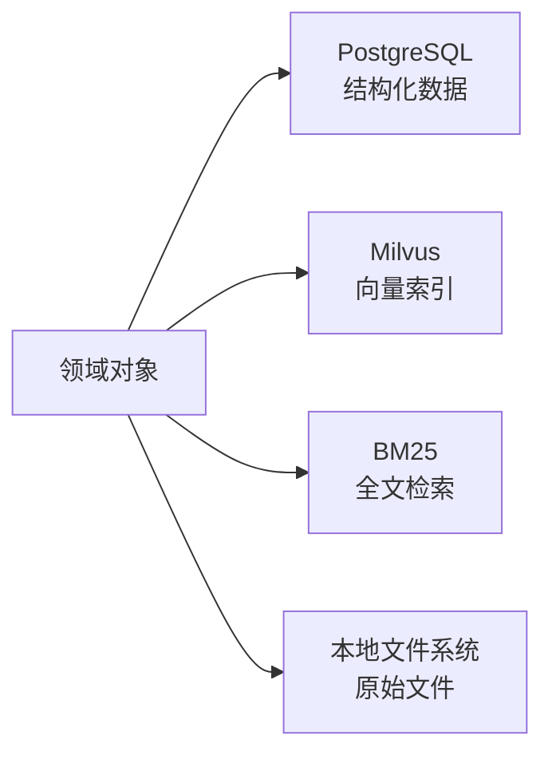

# 4.1 存储层映射设计

## 任务目标

定义个人知识库 RAG 项目第一阶段中，不同类型数据如何映射到关系型数据库、向量数据库、全文检索和对象存储中，明确各存储层职责边界，避免结构化数据、原始文件和检索索引混存。

本子任务对应路线图中的 `4.1`：

- 确定哪些数据进入 PostgreSQL，哪些进入向量索引，哪些进入对象存储

## 关联文档

- `../step-03-domain-model/03.01-core-entity-list-and-responsibilities.md`
- `../step-03-domain-model/03.02-keys-foreign-keys-and-index-fields.md`
- `../step-03-domain-model/03.03-entity-relationships-and-deletion-strategies.md`
- `../step-02-system-architecture/02.01-system-context.md`
- `../step-02-system-architecture/02.02-main-business-flows.md`
- `../step-02-system-architecture/02.03-service-boundaries-and-module-responsibilities.md`
- `../step-01-product-scope/01.03-first-phase-data-source-scope.md`

## 用户确认结论

基于当前讨论，`4.1` 采用以下正式方案：

- 存储策略采用 `多存储协同`
- 主数据库采用 `PostgreSQL`
- 向量数据库采用 `Milvus`
- 全文检索采用 `BM25`
- 对象存储第一阶段采用 `本地文件系统`

## 第一阶段存储层总体方案

第一阶段建议将系统数据分为 4 类存储职责：

1. `PostgreSQL`
2. `Milvus`
3. `BM25 全文检索索引`
4. `本地文件系统对象存储`

它们的职责不是重复的，而是互补的：

- `PostgreSQL` 存放结构化业务数据
- `Milvus` 存放语义检索所需向量索引
- `BM25 全文检索索引` 提供全文检索能力
- `本地文件系统` 保存原始文件内容

## 总体映射图

## 存储层职责定义

### 1. PostgreSQL

#### 职责

- 存储核心业务实体
- 维护实体关系
- 维护任务状态
- 保存元数据、查询记录、生成结果、引用关系
- 承担主数据源角色

#### 为什么适合第一阶段

- 适合当前相对完整的领域模型
- 适合引用、生成结果、任务状态等复杂关系
- 后续可平滑支持更多约束、过滤和统计查询

### 2. Milvus

#### 职责

- 存储 `Chunk` 的向量索引
- 支持语义检索和相似内容召回

#### 为什么适合第一阶段

- 比重型向量平台更适合本项目当前阶段
- 对本地开发与中小规模知识库更友好
- 支持 metadata filter，与文档范围过滤需求兼容

### 3. BM25 全文检索索引

#### 职责

- 提供关键词检索
- 提供标题和正文的全文匹配能力
- 为混合检索提供字面召回通道

#### 为什么适合第一阶段

- 能为第一阶段提供更标准的关键词相关性排序
- 足以支撑当前 Markdown / PDF 文本内容检索
- 可与 PostgreSQL 主数据配合，保持结构化数据与检索索引分层

### 4. 本地文件系统对象存储

#### 职责

- 保存原始 Markdown 文件
- 保存原始 PDF 文件
- 保存未来可扩展的附件文件

#### 为什么适合第一阶段

- 适合本地运行和个人工具场景
- 成本低、实现简单
- 可以在架构层保留未来切换到 MinIO / S3 的抽象

## 核心实体到存储层的映射

### 1. `Source`

#### 存储位置

- `PostgreSQL`

#### 说明

- `Source` 是完整来源对象，属于结构化业务实体
- 需要参与关系管理、去重判断和追溯逻辑

### 2. `Document`

#### 存储位置

- `PostgreSQL`
- 原始文件内容对应 `本地文件系统`
- 文本内容参与 `BM25` 检索索引

#### 说明

- `Document` 的元数据和状态属于主数据
- 原始文件本体不直接塞数据库，保存在本地文件系统
- 文档文本内容或可检索投影应进入全文检索能力

### 3. `Section`

#### 存储位置

- `PostgreSQL`

#### 说明

- `Section` 是结构化文档层级信息
- 不需要进入向量库或对象存储

### 4. `Chunk`

#### 存储位置

- `PostgreSQL`
- `Milvus`
- `BM25 全文检索索引`

#### 说明

- `Chunk` 的文本、定位信息、文档归属和 section 关系应存入 PostgreSQL
- `Chunk` 的 embedding 及向量检索索引进入 Milvus
- `Chunk` 的可检索文本应进入 BM25 检索索引

### 5. `Tag`

#### 存储位置

- `PostgreSQL`

#### 说明

- 标签属于关系型组织信息
- 主要用于过滤、归类和后续扩展

### 6. `ImportJob`

#### 存储位置

- `PostgreSQL`

#### 说明

- 导入任务本质上是流程状态对象
- 需要可追踪、可过滤、可审计

### 7. `QueryRecord`

#### 存储位置

- `PostgreSQL`

#### 说明

- 查询记录是轻量日志型业务对象
- 需要为评估、历史和复盘提供依据

### 8. `GeneratedArtifact`

#### 存储位置

- `PostgreSQL`

#### 说明

- 生成结果属于结构化业务数据
- 需要关联 `QueryRecord`、`Citation` 和类型信息

### 9. `Citation`

#### 存储位置

- `PostgreSQL`

#### 说明

- 引用关系是强结构化对象
- 需要支持定位、失效标记和引用回溯

### 10. `DocumentTag`

#### 存储位置

- `PostgreSQL`

#### 说明

- 关联表属于典型关系型数据

## 哪些数据进入 PostgreSQL

第一阶段进入 PostgreSQL 的主要数据包括：

- `Source`
- `Document`
- `Section`
- `Chunk` 的结构化字段
- `Tag`
- `DocumentTag`
- `ImportJob`
- `QueryRecord`
- `GeneratedArtifact`
- `Citation`

### 典型存储内容

- 标题
- 路径引用
- 元数据
- 状态字段
- 定位信息
- 关系字段
- 类型字段
- 时间字段

## 哪些数据进入 Milvus

第一阶段进入 Milvus 的主要数据包括：

- `Chunk` 向量
- 与 chunk 关联的最小必要 metadata

### 推荐 metadata 范围

- `chunk_id`
- `document_id`
- `section_id`
- `document_type`
- 可选标签或过滤字段

### 设计原则

- Milvus 中只存放检索所需最小必要信息
- 业务真相仍然以 PostgreSQL 为主
- 不把 Milvus 当作主数据源

## 哪些数据进入 BM25 全文检索索引

第一阶段进入全文检索通道的数据包括：

- `Document` 标题
- `Section` 标题
- `Chunk` 文本内容
- 可辅助检索的关键词信息

### 设计原则

- 全文检索主要服务关键词和精确命中
- 向量检索主要服务语义召回
- 两者共同组成混合检索链路

## 哪些数据进入本地文件系统对象存储

第一阶段进入对象存储的数据包括：

- 原始 Markdown 文件
- 原始 PDF 文件
- 未来扩展的附件文件

### 设计原则

- 原始文件是事实来源
- 数据库存放的是文件路径、引用和元数据
- 文件系统实现当前作为本地对象存储主实现

## 不建议放错位置的数据

### 不建议只放向量库的数据

以下数据不应只存在于向量数据库中：

- 文档元数据
- 任务状态
- 生成结果
- 引用关系
- 查询记录

原因：

- 这些都属于强结构化业务对象

### 不建议直接塞数据库大字段的内容

以下数据不建议直接作为数据库主存储的大对象：

- 原始 PDF 二进制
- 原始 Markdown 文件本体

原因：

- 不利于本地文件管理与后续对象存储抽象

## 第一阶段存储协同原则

### 1. PostgreSQL 是主数据源

所有核心业务真相以 PostgreSQL 为准。

### 2. Milvus 是检索加速层

Milvus 只承担向量召回职责，不承担主数据职责。

### 3. BM25 是字面检索层

全文检索是混合检索的重要组成部分，但不是唯一检索方式。

### 4. 本地文件系统是原始文件事实层

原始文件不应因后续数据库结构变化而丢失。

## 第一阶段不在 `4.1` 深入展开的内容

以下内容不在本任务中细化：

- PostgreSQL 表结构明细
- Milvus collection 结构细节
- BM25 检索字段拼接策略
- 本地文件目录命名规范
- 同步与一致性机制细节

这些内容将在后续 `4.2`、`4.3`、`5.x`、`8.x` 中继续展开。

## 对后续任务的影响

`4.1` 的结论将直接影响：

- `4.2` 表结构草案设计
- `4.3` 索引与增量更新策略
- `5.x` 导入链路写入逻辑
- `8.x` 混合检索实现设计
- `10.x` 引用和生成结果落存设计

## 最终结论

第一阶段采用“PostgreSQL 作为主数据源、Milvus 负责向量检索、BM25 负责全文检索、本地文件系统负责原始文件”的多存储协同方案：

- 结构化数据归 PostgreSQL
- 语义检索归 Milvus
- 关键词检索归 BM25
- 原始文件归本地文件系统

这种划分能在第一阶段同时兼顾：

- 本地运行可行性
- 结构化关系建模能力
- 检索效果
- 后续扩展空间
